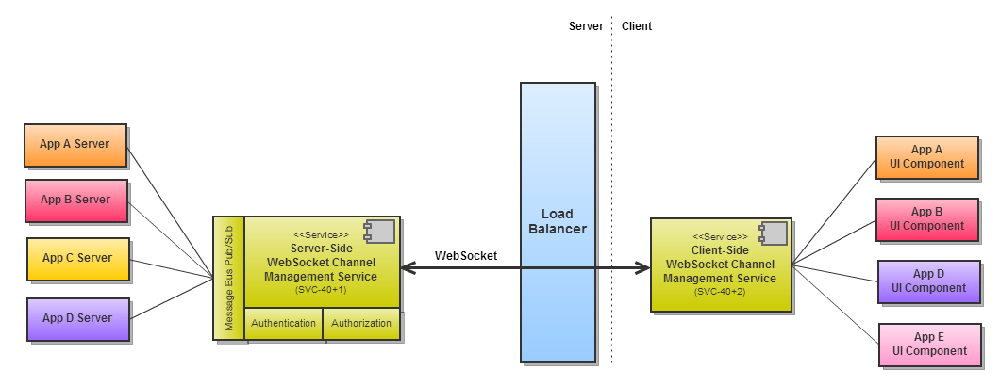
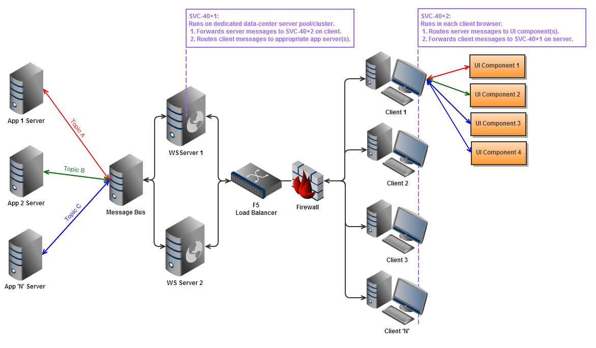
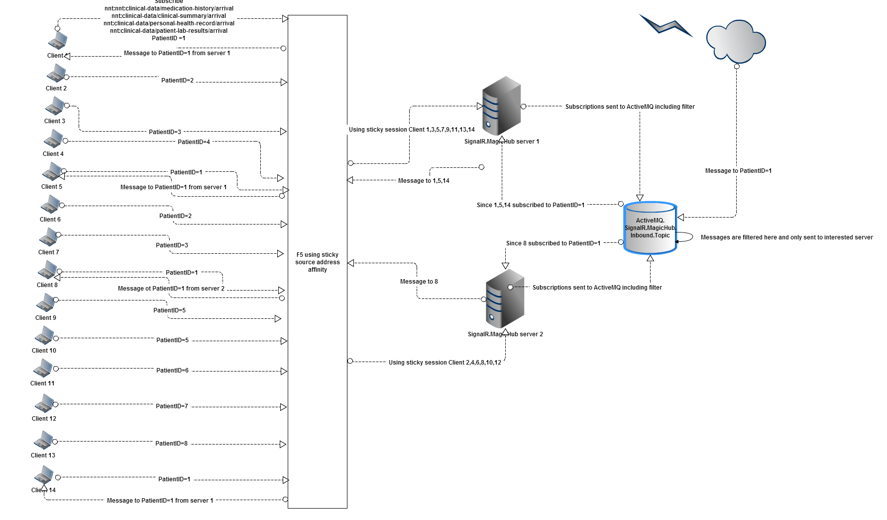

<!-- NOTE -->
<!-- Since git ui doesn't display the md correctly; Export this document to README.html using MarkdownPad 2 and modify html by removing 
    html, head and body tags manually
    body css 
-->

## Summary

SignalR.MagicHub is a publish-subscribe framework built on top of ASP.NET SignalR, which is an Open Source Microsoft.NET-based WebSockets framework. WebSockets is an Internet standard created in 2011 that provides for a realtime communication channels to be open between a web browser and a server. MagicHub makes it possible to use a single WebSocket channel to transmit messages and data of any topic to UI components on the browser. Without MagicHub each component would have to open its own channel, which is inefficient on the browser and requires more server capacity in data center.

## Pre-requiste 
Read [ASP.NET SignalR Documentation](http://www.asp.net/signalr/overview/getting-started)

## Developer Setup
    
	git clone git@git:SignalR.MagicHub
	cd SignalR.MagicHub
    build && build install

## Design

### Component Diagrams

### Network Topology

## Authentication

By default MagicHub requires user to be authenticated. `Context.User.Identity.IsAuthenticated` is used in authentication.

To disable authentication: sample Startup 
	
	public partial class Startup
    {
        public void Configuration(IAppBuilder app)
        {
			GlobalHost.Configuration.AllowAnonymous();
		}
    }

For further documentation on how authentication works; see [SignalR Hub Authorizaton](http://www.asp.net/signalr/overview/security/hub-authorization)	

## Authorization

To add topic level authorization, Implement `IAuthorize` and register in startup 

	GlobalHost.DependencyResolver.Register(typeof(IAuthroize), () => ClaimsAuthrorization());

See [SignalR Extensibility](https://github.com/SignalR/SignalR/wiki/Extensibility) on how to replace dependency resolver. 

## Message Bus

To listen and send messages coming on the message bus to browser clients, implement `IMessageBus` and register

	GlobalHost.DependencyResolver.Register(typeof(IMessageBus), () => MessageBus());

## Client Usage
To integrate with magic-hub browser side including following javascript on the page

	 

#### Dependencies
* jquery
* json parser

For convenience magic-hub javascript packages SignalR and dynamically generated hub javascript into one file. 

### How to establish a connection

Magic hub doesn't establish connection unless explicitly started. To start magic hub call start:

    $.connection.magicHub.start(url)
        .done(function(){ console.log('Connected'); })
        .fail(function(){ console.log('Houston, We have a problem'); });

<dl>
	<dt>url</dt>
	<dd>string</dd>
	<dd>optional</dd>
	<dd>The <code>url</code> of the websocket domain. If url is not passed in magic-hub defaults to dynamic domain.</dd> 
</dl>

### How to subscribe to a topic

    $.connection.magicHub.on(topic, filter, callback)
        .done(function() { console.log('Thank you for subscribing'); })
        .fail(function() { console.log('Why no like?'); } );

<dl>
    <dt>topic</dt>
    <dd>string</dd>
    <dd>The <code>topic</code> defines the event that you would be interested to get messages on.
    </dd>
	<dt>filter</dt>
	<dd>string</dd>
	<dd>optional</dd>
	<dd>The <code>filter</code> defines the condition that you would be interested to get messages on. Filters are defined using SQL 92 syntax and typically apply to message headers. </dd>
    <dt>callback</dt>
    <dd>function</dd>
    <dd><code>callback</code> would be called when magic hub receives a message on the <code>topic</code></dd>
</dl>

#### Example

    $.connection.magicHub.on('echo', function(topic, data) { 
        alert("callback for echo"); });

-

    $.connection.magicHub.on('echo', "PatientID='1'",  function(topic, data) { 
        alert("callback for echo patientid 1"); });

### How to send a message

    $.connection.magicHub.send(topic, message)
        .done(function() { console.log('Thank you for sending message'); })
        .fail(function() { console.log('What's up with you?'); } );

<dl>
    <dt>topic</dt>
    <dd>string</dd>
    <dd>The <code>topic</code> defines the event <code>message </code>is applicable to.
    </dd>
    <dt>message</dt>
    <dd>json</dd>
    <dd><code>message</code> preferred format is json</dd>
</dl>

#### Example

	$.connection.magicHub.send('echo', { message: "hello world!" });

### How to unsubscribe

    $.connection.magicHub.off(topic, filter, callback)
        .done(function() { console.log('Thank you for unsubscribing'); })
        .fail(function() { console.log('Why no like?'); } );

<dl>
    <dt>topic</dt>
    <dd>string</dd>
    <dd>The <code>topic</code> defines the event that you would like to unsubscribe on.
	</dd>
	<dt>filter</dt>
	<dd>string</dd>
	<dd>optional</dd>
	<dd>The <code>filter</code> defines the condition that you would be interested to get messages on. Filters are defined using SQL 92 syntax and typically apply to message headers. </dd>
	<dt>callback</dt>
    <dd>function</dd>
    <dd><code>callback</code> reference should be the same one that was used in subscription</dd>
</dl>

#### Example
    var callback = function(topic, data) { alert("callback for echo"); };
    $.connection.magicHub.off('echo', callback);
	
-

    var callback = function(topic, data) { alert("callback for echo"); };
    $.connection.magicHub.off('echo', "PatientID='1'", callback);

## Filters
At the time of subscription for topic, filters can be provided as an argument. Filters follow the <a href="http://activemq.apache.org/selectors.html">SQL 92</a> syntax. 

Filtering has been moved into MagicHub. We support a subset of the SQL-92 syntax. The `BETWEEN` operator is not supported, and dates are not supported.

The project is configured to cache filters in memory to avoid repeated parsing of the same string.
 

## Session Management
For long polling each requests go through the authentication; but for websockets once the channel is established even though session is expired the channel would not expire. To secure this there is an intelligent background worker that runs in-process which detects the session expiration. Once the session expiration is detected all subscriptions for activemq for that session is disconnected. All messages to that channel are stopped from server side. 

### Configure Session Provider

Implement `ISessionStateProvider` and register.

	GlobalHost.DependencyResolver.Register(typeof(ISessionStateProvider), () => SessionStateProvider());

## Source Address Affinity Routing

## Exception Handling / Logging / Tracing

### Warnings
We have observed that one of the components we use sometimes experiences a timeout when subscribing to a topic. Despite this, everything seems to continue functioning according to specification. We have only observed this for connections using the longpolling transport. In order to monitor this, we log a warning

`Groups add seems to have timed out. ConnectionId=GUID Topic=TOPIC Filter=FILTER`
### Exceptions
#### Server
To log any unhandled exception NLog + NLog.Syslog formatter can be used. NLog configuration can be found in Web.config. Out of the box there is a single log target defined: Event Log. All messages with minimum level of "Warn" will be sent to Event Log.

#### Client
Any exceptions on client side are logged to browser console window.

### Tracing
Messages can be traced by setting  `tracing_enabled:true` in the json body. When tracing is enabled in the message, the message is logged. On the server side message is logged to Trace listener; On the client side message is logged to console window. 

See [how to enable tracing](http://www.asp.net/signalr/overview/testing-and-debugging/enabling-signalr-tracing).

On the server side, there will be up to 4 messages in the event log / splunk:

1. [only if application sends message, which doesn't happen currently]. 
`Receiving message (nnt:trace-test0): {"message":"","tracing_enabled":true}` 
2. [see below] message with tracking id when ServiceHost component receives message from bus
3. When MagicHub receives message from ServiceHost
`Received message from messagebus (nnt:trace-test0): {"message":"","tracing_enabled":true}`
4. When MagicHub dispatches the message to SignalR to send to the web browser
`Sending message (nnt:trace-test0): {"message":"","tracing_enabled":true}`   
